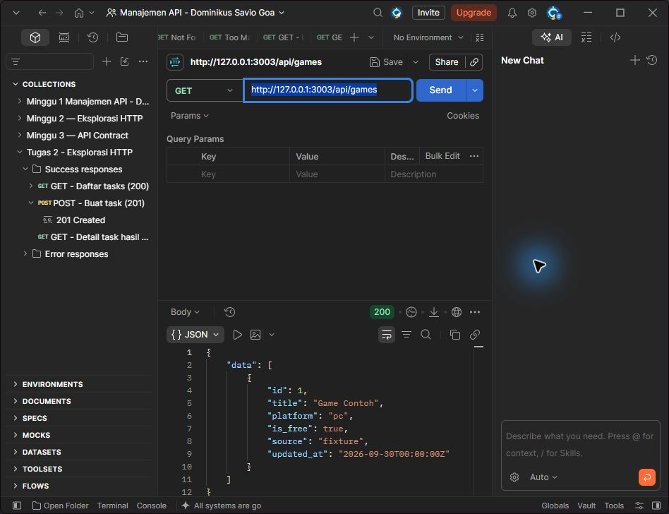
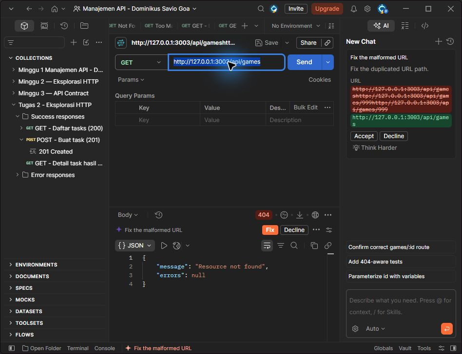

# Tugas 3 — Draft API Contract

## 1. Tujuan
Menentukan bentuk API GameHunter agar client dan backend memakai aturan yang sama. Fokus minggu ini adalah desain contract; Laravel dan database dikerjakan pada minggu berikutnya.

## 2. Perubahan
Saya memilih katalog game sebagai fitur awal. Endpoint memakai kata benda jamak, field memakai snake_case, dan response sukses dibungkus `data`. Mock lokal disediakan untuk mencoba contract tanpa database.

| Resource | Kegunaan | Hubungan |
| --- | --- | --- |
| games | Katalog game | Satu game memiliki banyak deals dan reviews |
| deals | Diskon dari toko | Mengacu ke game dan store |
| stores | Toko digital | Memiliki banyak deals |
| users | Profil pengguna | Memiliki wishlists dan price-alerts |
| wishlists | Game incaran | Menghubungkan user dengan game |
| price-alerts | Target harga | Mengacu ke user dan game |
| reviews | Ulasan game | Mengacu ke user dan game |

Yang sudah menjadi contract teruji adalah `games`. Resource lainnya masih rencana. FreeToGame menyediakan katalog free-to-play, sehingga giveaway berbatas waktu belum dijanjikan pada tahap ini.

## 3. Endpoint atau contract
Base URL mock: `http://127.0.0.1:3003`. Header request: `Accept: application/json`. Tanpa autentikasi karena katalog bersifat publik.

| Method | Endpoint | Hasil |
| --- | --- | --- |
| GET | `/api/games` | 200, daftar game |
| GET | `/api/games?platform=pc` | 200, filter platform |
| GET | `/api/games/{id}` | 200 detail, 404 jika tidak ada |

Query `platform` opsional, string, hanya `pc` atau `browser`. Parameter lain ditolak dengan 422. Daftar kosong tetap 200 dengan `data: []`. ID berupa integer positif; ID yang tidak tersedia menghasilkan 404. Method selain GET menghasilkan 405. Tahap ini belum menyediakan pagination atau operasi tulis.

| Field game | Tipe | Akses dan aturan |
| --- | --- | --- |
| id | integer | Read-only, identitas internal positif |
| title | string | Read-only, nama game 1–200 karakter |
| platform | string | Read-only, pc atau browser |
| is_free | boolean | Read-only, true/false |
| source | string | Read-only, fixture pada mock; freetogame/cheapshark saat integrasi |
| updated_at | string | Read-only, waktu ISO 8601 |

Contoh `GET /api/games/1` — 200:

```json
{"data":{"id":1,"title":"Game Contoh","platform":"pc","is_free":true,"source":"fixture","updated_at":"2026-09-30T00:00:00Z"}}
```

Untuk daftar, object yang sama berada di dalam array `data`. Semua data mock adalah contoh tetap, bukan data game atau harga terbaru.

Keputusan ini membuat tipe field stabil. `is_free` memakai boolean agar client tidak menafsirkan string. ID internal dipisahkan dari ID penyedia agar perubahan sumber data tidak mengubah URL milik client.

## 4. Bukti pengujian
Jalankan dari folder tugas:

```bash
node docs/mock-server.cjs
```

Import `docs/GameHunter.postman_collection.json` ke Postman, lalu jalankan collection. Script test memeriksa status, Content-Type, bentuk data, dan error. Hasil HTTP yang direkam tersedia di [hasil-pengujian.json](hasil-pengujian.json).

Pengujian ini memverifikasi mock contract, belum backend Laravel, database, autentikasi, atau sinkronisasi API luar. Collection dapat dijalankan ulang dengan Node.js dan Postman/Newman.

Hasil Newman: **6 request, 18 assertion lulus, 0 gagal**. Laporan lengkap: [newman-report.json](newman-report.json). Jalankan ulang dengan `npx newman run docs/GameHunter.postman_collection.json` saat mock aktif.





Catatan screenshot 404: request sempat memakai path salah ketik/URL terduplikasi, lalu Postman menampilkan saran perbaikan. Screenshot ini menunjukkan respons 404 dari path yang tidak dikenal; teks URL di editor bukan bukti pengujian `/api/games/999`. Skenario ID 999 yang benar telah diuji terpisah oleh Newman dan tercatat di laporan JSON.

## 5. Error case
`GET /api/games/999` — 404:

```json
{"message":"Resource not found","errors":null}
```

`GET /api/games?platform=console` — 422:

```json
{"message":"The given data was invalid.","errors":{"platform":["Gunakan platform pc atau browser; hanya parameter platform yang didukung."]}}
```

Error menggunakan `message` dan `errors` secara konsisten. Body tidak memuat stack trace atau credential.

## 6. Kesimpulan
Contract katalog GameHunter sudah dapat dicoba lewat mock lokal. Tahap berikutnya menerjemahkan endpoint ke route Laravel, validasi ke Form Request, dan response ke API Resource. Hasil Praktikum 3 belum tersedia di repository yang diperiksa, jadi laporan ini memakai materi dan ide proyek dari Minggu 1.

## 7. Referensi
- Materi 3 — API Contract dan Resource Modelling, bahan kelas.
- [Ide proyek Minggu 1](../../docs/minggu-1-audit-api.md).
- [FreeToGame API](https://www.freetogame.com/api-doc).
- [CheapShark API](https://apidocs.cheapshark.com/).
- [Laravel: validation](https://laravel.com/framework/docs/12.x/validation#validation-error-response-format).

## 8. Deklarasi penggunaan AI
AI membantu menyusun draft contract, mock, collection, dokumentasi, dan menjalankan pengujian. Saya perlu membaca serta memahami hasilnya sebelum mengumpulkan dan menjelaskan tugas kepada dosen. Bukti mock tidak dinyatakan sebagai pengujian Laravel.
