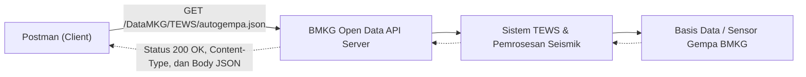

# Tugas 1 - Audit API dan Ide Proyek

## 1. Identitas API

API yang saya pilih adalah **BMKG Open Data API** pada layanan **TEWS (Indonesia Tsunami Early Warning System)** yang dikelola langsung oleh Badan Meteorologi, Klimatologi, dan Geofisika (BMKG) Republik Indonesia. BMKG menyediakan data terbuka (*open data*) resmi yang dapat diakses oleh publik untuk keperluan diseminasi informasi cuaca, iklim, kualitas udara, serta gempa bumi dan peringatan dini tsunami.

Pada pengujian ini, saya menggunakan endpoint **Data Gempabumi Terkini (`autogempa.json`)** yang menyediakan informasi mutakhir mengenai kejadian gempa bumi terbaru secara otomatis.

Pengguna API ini meliputi:
- Pengembang aplikasi mobile dan web kebencanaan.
- Media massa dan jurnalis untuk penyebaran informasi darurat yang valid.
- Instansi pemerintah, BPBD, relawan tanggap darurat, dan tim evakuasi.
- Masyarakat umum dan civitas akademika yang membutuhkan integrasi notifikasi bencana alam secara *real-time*.

## 2. Masalah atau Kebutuhan Pengguna

Indonesia berada di jalur pertemuan tiga lempeng tektonik dunia (*Ring of Fire*), sehingga frekuensi kejadian gempa bumi sangat tinggi. Saat terjadi gempa bumi, masyarakat maupun pihak berwenang memerlukan informasi yang sangat cepat, akurat, dan terverifikasi untuk menentukan langkah mitigasi atau evakuasi.

Kebutuhan pengguna terhadap API ini antara lain:
1. **Kecepatan Akses Data:** Mengakses portal web secara manual saat keadaan darurat sering kali lambat karena beban lalu lintas pengguna yang tinggi.
2. **Kebutuhan Integrasi Sistem:** Sistem otomatis seperti bot perpesanan (Telegram/WhatsApp), sirine kampus, atau aplikasi mobile membutuhkan data terstruktur (*machine-readable*) agar dapat memicu peringatan darurat secara otomatis tanpa campur tangan manusia.
3. **Validitas Sumber:** Informasi bencana harus bersumber dari lembaga resmi negara untuk mencegah penyebaran hoaks dan kepanikan publik.

BMKG Open Data API memenuhi kebutuhan tersebut dengan menyediakan berkas JSON publik yang diperbarui secara otomatis setiap kali sistem seismik mendeteksi gempa baru.

## 3. Hasil Pengujian Endpoint

Pengujian dilakukan menggunakan Postman tanpa memerlukan proses registrasi maupun autentikasi (*No Auth*), karena data ini merupakan data publik terbuka.

### Request

| Elemen | Nilai |
| --- | --- |
| Nama request | BMKG - Get Gempa Terkini (Autogempa) |
| Method | GET |
| URL | `https://data.bmkg.go.id/DataMKG/TEWS/autogempa.json` |
| Authentication | No Auth |
| Header Accept | `application/json` |

### Response

Request menghasilkan status code `200 OK`. Header response `Content-Type` bernilai `application/json`, yang menandakan server mengirimkan data dalam format JSON.

Berikut adalah body response JSON aktual yang diterima dari BMKG:

```json
{
  "Infogempa": {
    "gempa": {
      "Tanggal": "12 Sep 2026",
      "Jam": "20:42:16 WIB",
      "DateTime": "2026-09-12T13:42:16+00:00",
      "Coordinates": "-3.48,135.55",
      "Lintang": "3.48 LS",
      "Bujur": "135.55 BT",
      "Magnitude": "3.6",
      "Kedalaman": "5 km",
      "Wilayah": "Pusat gempa berada di darat 14 km selatan Nabire",
      "Potensi": "Gempa ini dirasakan untuk diteruskan pada masyarakat",
      "Dirasakan": "III Nabire",
      "Shakemap": "20260912204216.mmi.jpg"
    }
  }
}
```

### Penjelasan Bagian Penting Response:
- **`Tanggal` & `Jam`**: Waktu pencatatan kejadian gempa dalam format zona waktu lokal Indonesia (WIB).
- **`DateTime`**: Waktu standar internasional dalam format ISO 8601 UTC (`2026-09-12T13:42:16+00:00`) untuk mempermudah pengolahan waktu pada sistem komputer.
- **`Coordinates` / `Lintang` / `Bujur`**: Koordinat titik episentrum gempa bumi di permukaan bumi.
- **`Magnitude`**: Besaran kekuatan gempa bumi (skala Richter/magnitudo).
- **`Kedalaman`**: Kedalaman pusat gempa (hiposentrum) di bawah permukaan bumi (misal: 5 km).
- **`Wilayah`**: Keterangan letak geografis pusat gempa relatif terhadap daerah pemukiman terdekat.
- **`Potensi`**: Penilaian potensi bahaya gempa bumi, seperti apakah berpotensi menimbulkan tsunami atau dirasakan oleh masyarakat.
- **`Dirasakan`**: Intensitas getaran yang dirasakan masyarakat berdasarkan skala MMI (*Modified Mercalli Intensity*).
- **`Shakemap`**: Nama berkas gambar peta guncangan visual yang dapat diunduh dari server BMKG.

## 4. Peta Sistem



Alur komunikasi sistem:
1. **Client (Postman)** mengirimkan HTTP GET Request ke alamat endpoint BMKG.
2. **Web API Server BMKG** menerima request dan membaca berkas data yang telah disiapkan secara otomatis oleh sistem peringatan dini TEWS (*Tsunami Early Warning System*).
3. **Sistem Pengolahan Seismik BMKG** secara berkala memperbarui data dari jaringan sensor gempa di seluruh Indonesia.
4. Server BMKG mengembalikan HTTP Response dengan status `200 OK`, header `Content-Type: application/json`, beserta payload JSON berisi informasi gempa terkini kepada client.

## 5. Kondisi Berhasil dan Gagal

### Kondisi Berhasil (200 OK)

- **Request**: `GET https://data.bmkg.go.id/DataMKG/TEWS/autogempa.json`
- **Status Code**: `200 OK`
- **Header**: `Content-Type: application/json`
- **Hasil**: Server berhasil menemukan data dan mengembalikan data JSON terstruktur mengenai gempa bumi terkini.

Berikut adalah bukti tangkapan layar pengujian berhasil di Postman:


### Kondisi Gagal (400 Bad Request)

- **Request**: `GET https://data.bmkg.go.id/DataMKG/TEWS/%` (menggunakan sintaks URL tidak valid / karakter terlarang)
- **Status Code**: `400 Bad Request`
- **Header**: `Content-Type: text/html`
- **Hasil**: Web server menolak permintaan karena format URL tidak valid dan mengembalikan respon HTML:

```html
<h2>Bad Request - Invalid URL</h2>
<p>HTTP Error 400. The request URL is invalid.</p>
```

Berikut adalah bukti tangkapan layar pengujian respon gagal di Postman:


### Analisis Perbedaan:
1. **Status Code**: Respon berhasil mengembalikan status `200 OK`, sedangkan URL dengan sintaks rusak menghasilkan error `400 Bad Request`.
2. **Format Response**: Respon berhasil berupa berkas terstruktur `application/json`, sedangkan respon gagal berupa halaman dokumen `text/html`.
3. **Pentingnya Validasi Client**: Client wajib melakukan pengecekan HTTP Status Code sebelum memproses body data agar sistem tidak mengalami kegagalan (*error parsing*) saat menerima dokumen HTML dari server.

## 6. Ide Proyek Semester

### Nama proyek

**Game Deals & Free Games Aggregator API (GameHunter API)**

### Masalah yang ingin diselesaikan

Banyak penggemar game dan mahasiswa ingin memainkan game PC original berkualitas di platform resmi (seperti Steam, Epic Games Store, dan GOG), namun sering terkendala harga yang mahal atau terlambat mengetahui informasi promosi *giveaway* game gratis berbatas waktu. Selain itu, mencari perbandingan diskon harga game termurah antar-toko digital secara manual memerlukan waktu dan sering kali melelahkan.

Proyek ini bertujuan membangun sebuah Web Service / REST API perantara (*aggregator*) yang secara otomatis mengambil data promosi game gratis dan diskon harga dari API publik eksternal (**CheapShark API** dan **FreeToGame API**). Data tersebut kemudian diolah, disimpan ke dalam database lokal, dan disajikan kembali melalui REST API dengan fitur personalisasi untuk pengguna, seperti daftar impian (*wishlist*), peringatan harga turun (*price alert*), serta kurasi game yang ramah spesifikasi laptop mahasiswa (*PC Kentang*).

### Pengguna

- **Mahasiswa & Gamers**: Mencari informasi game gratis yang sedang aktif, memantau diskon game impian (*wishlist*), mengatur peringatan harga batas bawah (*price alert*), serta membaca dan membagikan ulasan performa game pada laptop spesifikasi standar.
- **Admin Sistem**: Mengelola kategori kurasi game, memantau sinkronisasi berkala dari API luar, dan memoderasi ulasan komunitas.

### Resource awal

- `users`: Menyimpan data akun, kredensial autentikasi, dan profil pengguna.
- `wishlists`: Menyimpan daftar game impian yang ditandai oleh pengguna.
- `price_alerts`: Menyimpan preferensi target harga (misalnya: beri tanda notifikasi jika harga game turun di bawah Rp 100.000 atau diskon di atas 70%).
- `game_reviews`: Menyimpan ulasan komunitas, rating bintang, dan informasi apakah game tersebut lancar dimainkan di laptop spesifikasi standar mahasiswa.
- `free_games`: Menyimpan katalog game gratis dan penawaran *giveaway* yang disinkronkan dari API eksternal.

### Contoh endpoint awal

| Method | Endpoint | Fungsi |
| --- | --- | --- |
| GET | `/api/games/free` | Mengambil daftar game PC yang sedang gratis atau promo *giveaway* aktif. |
| GET | `/api/games/deals` | Mengambil daftar promo diskon game terbaik (dapat difilter berdasarkan harga & platform toko). |
| POST | `/api/wishlist` | Menambahkan game incaran ke daftar *wishlist* pengguna. |
| GET | `/api/wishlist` | Melihat daftar game impian milik pengguna beserta status diskon terbarunya. |
| POST | `/api/alerts` | Mendaftarkan aturan notifikasi target harga (*price alert*) untuk game tertentu. |
| POST | `/api/reviews` | Mengirimkan ulasan dan rekomendasi game untuk komunitas. |
| DELETE | `/api/wishlist/{id}` | Menghapus game dari daftar *wishlist*. |

### Batas awal proyek

- **Ruang Lingkup**: Versi awal berfokus pada pengambilan data diskon dan game gratis dari API eksternal, manajemen data akun pengguna, pengelolaan *wishlist* dan *price alert*, serta sistem ulasan komunitas.
- **Batasan**: Transaksi pembayaran langsung di dalam sistem ditiadakan (aplikasi hanya mengarahkan tautan langsung ke etalase resmi toko seperti Steam atau Epic Games Store), dan fitur obrolan langsung (*live chat*) antarpengguna belum dimasukkan agar ruang lingkup pengerjaan realistis diselesaikan dalam rentang satu semester.
- **Teknologi**: API akan dibangun sebagai REST API menggunakan framework **Laravel**, basis data relasional **MySQL**, pengujian fungsional menggunakan **Postman**, dan integrasi data eksternal memanfaatkan HTTP Client Laravel.

## 7. Referensi Resmi

1. **Portal Data Terbuka BMKG**: [https://data.bmkg.go.id/](https://data.bmkg.go.id/)
2. **Dokumentasi Gempabumi BMKG**: [https://data.bmkg.go.id/gempabumi/](https://data.bmkg.go.id/gempabumi/)
3. **CheapShark API Documentation**: [https://apidocs.cheapshark.com/](https://apidocs.cheapshark.com/)
4. **FreeToGame API Documentation**: [https://www.freetogame.com/api-doc](https://www.freetogame.com/api-doc)
5. **Hasil Pengujian Mandiri**: Pengujian endpoint API secara langsung menggunakan Postman pada tanggal 12 September 2026.

## 8. Deklarasi Penggunaan AI

Saya menggunakan alat bantu AI sebagai asisten belajar dan panduan teknis selama proses pengerjaan tugas ini. Bantuan AI dimanfaatkan untuk mengeksplorasi pilihan API publik yang relevan, membantu merapikan struktur penulisan laporan akademik, menyusun format tabel, serta merapikan diagram arsitektur sistem menggunakan Mermaid syntax.

Pengujian endpoint API dilakukan secara mandiri menggunakan aplikasi Postman pada endpoint resmi BMKG. Data request, response JSON, serta analisis kondisi error diperiksa dan diverifikasi secara langsung dari hasil eksekusi nyata. Ide proyek semester mengenai sistem agregator game gratis dan pelacak diskon PC (GameHunter API) dirumuskan berdasarkan minat dan kebutuhan mahasiswa dalam mengoptimalkan anggaran hiburan digital secara hemat dan legal.
