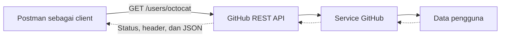

# Tugas 1 - Audit API dan Ide Proyek Semester

## Identitas Mahasiswa

- Nama: Dominikus Savio Goa
- NIM: 2024340035
- Mata Kuliah: Manajemen Web Service
- Tanggal: 12 September 2026

## 1. Identitas API

API yang saya pilih adalah GitHub REST API. GitHub merupakan layanan yang digunakan untuk menyimpan dan mengelola proyek perangkat lunak dengan Git. Melalui REST API, aplikasi lain dapat membaca atau mengelola data GitHub, seperti data pengguna, repository, issue, pull request, dan organisasi.

Pada tugas ini, saya menggunakan endpoint **Get a user** untuk mengambil informasi publik dari satu akun GitHub. Pengguna API ini antara lain pengembang aplikasi, pengelola proyek, tim perangkat lunak, serta aplikasi yang membutuhkan data publik dari GitHub.

## 2. Masalah atau Kebutuhan Pengguna

Pengguna terkadang membutuhkan informasi akun GitHub tanpa membuka halaman profil secara manual. Sebagai contoh, sebuah aplikasi dapat menampilkan nama akun, jumlah repository publik, atau tautan profil berdasarkan username yang dimasukkan.

GitHub REST API membantu memenuhi kebutuhan tersebut dengan menyediakan data dalam format JSON. Client hanya perlu mengirim username melalui URL, kemudian API akan mengembalikan data pengguna apabila akun tersebut tersedia.

## 3. Hasil Pengujian Endpoint

Pengujian dilakukan menggunakan Postman tanpa authentication karena data yang diminta merupakan data publik.

### Request

| Elemen | Nilai |
| --- | --- |
| Nama request | GitHub - Get User |
| Method | GET |
| URL | https://api.github.com/users/octocat |
| Path parameter | username = octocat |
| Authentication | No Auth |
| Header Accept | application/vnd.github+json |
| Header versi API | X-GitHub-Api-Version: 2022-11-28 |

### Response

Request tersebut menghasilkan status `200 OK`. Header response `Content-Type` bernilai `application/json; charset=utf-8`, sehingga body yang diterima berformat JSON dengan encoding UTF-8.

Beberapa bagian penting dari body response adalah:

```json
{
  "login": "octocat",
  "id": 583231,
  "public_repos": 8,
  "url": "https://api.github.com/users/octocat"
}
```

Field `login` menunjukkan username pengguna. Field `id` merupakan identitas unik akun. Field `public_repos` menunjukkan jumlah repository publik, sedangkan field `url` berisi alamat API untuk data pengguna tersebut.

## 4. Peta Sistem



Postman bertindak sebagai client yang mengirim request ke GitHub REST API. API meneruskan permintaan agar service GitHub mencari data pengguna. Hasil pencarian kemudian dikirim kembali melalui API dalam bentuk status code, header, dan body JSON. Peta ini merupakan gambaran sederhana karena proses internal GitHub tidak dapat dilihat secara langsung melalui Postman.

## 5. Kondisi Berhasil dan Gagal

### Kondisi berhasil

Request `GET /users/octocat` menghasilkan status `200 OK` karena akun tersebut tersedia. Body response berisi data pengguna, seperti `login`, `id`, `public_repos`, dan `url`.

### Kondisi gagal

Untuk mencoba kondisi gagal, username pada URL diganti menjadi `user-tidak-ada-987654321`:

```text
https://api.github.com/users/user-tidak-ada-987654321
```

Request tersebut menghasilkan status `404 Not Found` dengan body:

```json
{
  "message": "Not Found",
  "documentation_url": "https://docs.github.com/rest",
  "status": "404"
}
```

Client dapat mengetahui bahwa request gagal dari status `404 Not Found`. Keberadaan body JSON saja tidak dapat dijadikan tanda bahwa request berhasil karena response berhasil dan gagal sama-sama dapat memiliki body JSON.

## 6. Ide Proyek Semester

### Nama proyek

API Pelaporan Kerusakan Fasilitas Kampus

### Masalah yang ingin diselesaikan

Mahasiswa dan staf kampus dapat menemukan fasilitas yang rusak, seperti kursi, lampu, komputer laboratorium, atau jaringan internet. Jika laporan hanya disampaikan secara lisan atau melalui pesan pribadi, laporan dapat terlambat ditangani dan sulit dipantau.

### Pengguna

- Mahasiswa dan staf sebagai pelapor.
- Petugas sarana dan prasarana sebagai pihak yang menangani laporan.
- Admin sebagai pengelola pengguna, kategori, lokasi, dan data laporan.

### Resource awal

- `users` untuk menyimpan data pengguna.
- `reports` untuk menyimpan laporan kerusakan.
- `categories` untuk menyimpan kategori kerusakan.
- `locations` untuk menyimpan lokasi fasilitas.
- `report_statuses` untuk mencatat perkembangan penanganan laporan.

### Contoh endpoint awal

| Method | Endpoint | Fungsi |
| --- | --- | --- |
| POST | /api/reports | Membuat laporan kerusakan baru. |
| GET | /api/reports | Melihat daftar laporan. |
| GET | /api/reports/{id} | Melihat detail satu laporan. |
| PATCH | /api/reports/{id}/status | Mengubah status penanganan laporan. |
| DELETE | /api/reports/{id} | Menghapus laporan sesuai hak akses. |

### Batas awal proyek

Versi awal proyek berfokus pada pembuatan laporan, daftar dan detail laporan, serta perubahan status menjadi `dilaporkan`, `diproses`, atau `selesai`. Fitur percakapan langsung, notifikasi real-time, dan integrasi dengan sistem kampus belum dimasukkan agar ruang lingkup proyek tetap dapat dikerjakan selama satu semester.

API akan dibuat sebagai REST API berbasis Laravel. Data disimpan dalam database relasional, sedangkan response dikirim kepada client dalam format JSON.

## 7. Referensi Resmi

1. [GitHub REST API - Get a user](https://docs.github.com/en/rest/users/users?apiVersion=2022-11-28#get-a-user)
2. [GitHub REST API - Getting started](https://docs.github.com/en/rest/using-the-rest-api/getting-started-with-the-rest-api)
3. Hasil pengujian Praktikum 1 menggunakan Postman.

## 8. Deklarasi Penggunaan AI

Saya menggunakan bantuan AI untuk membantu menyusun kerangka dokumen, merapikan bahasa, dan memberi masukan terhadap ide proyek. Pengujian endpoint dilakukan melalui Postman, kemudian hasil request dan response saya periksa kembali. Saya membaca dan memeriksa isi akhir dokumen sebelum dikumpulkan.

Dokumen ini tidak memuat API key, token, password, cookie, atau secret.
