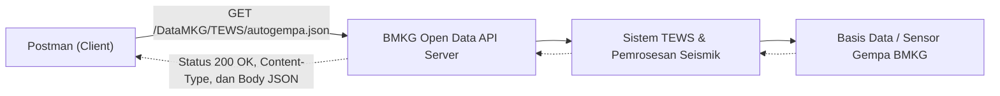

# Tugas 1 - Audit API dan Ide Proyek Semester

## Identitas Mahasiswa

- Nama: Dominikus Savio Goa
- NIM: 2024340035
- Mata Kuliah: Manajemen Web Service
- Tanggal: 12 September 2026

## 1. Identitas API

API yang saya pilih adalah **BMKG Open Data API** pada layanan **TEWS (Indonesia Tsunami Early Warning System)** yang dikelola langsung oleh Badan Meteorologi, Klimatologi, dan Geofisika (BMKG) Republik Indonesia. BMKG menyediakan data terbuka (*open data*) resmi yang dapat diakses oleh publik untuk keperluan diseminasi informasi cuaca, iklim, kualitas udara, serta gempa bumi dan peringatan dini tsunami.

Pada pengujian ini, saya menggunakan endpoint **Data Gempabumi Terkini (`autogempa.json`)** yang menyediakan informasi mutakhir mengenai kejadian gempa bumi terbaru secara otomatis.

Pengguna API ini meliputi:
- Pengembang aplikasi mobile dan web kebencanaan.
- Media massa dan jurnalis untuk penyebaran informasi darurat yang valid.
- Instansi pemerintah, BPBD, relawan tanggap darurat, dan tim evakuasi.
- Masyarakat umum dan civitas akademika yang membutuhkan integrasi notifikasi bencana alam secara *real-time*.

## 2. Masalah atau Kebutuhan Pengguna

Indonesia berada di jalur pertemuan tiga lempeng tektonik dunia (*Ring of Fire*), sehingga frekuensi kejadian gempa bumi sangat tinggi. Saat terjadi gempa bumi, masyarakat maupun pihak berwenang memerlukan informasi yang sangat cepat, akurat, dan terverifikasi untuk menentukan langkah mitigasi atau evakuasi.

Kebutuhan pengguna terhadap API ini antara lain:
1. **Kecepatan Akses Data:** Mengakses portal web secara manual saat keadaan darurat sering kali lambat karena beban lalu lintas pengguna yang tinggi.
2. **Kebutuhan Integrasi Sistem:** Sistem otomatis seperti bot perpesanan (Telegram/WhatsApp), sirine kampus, atau aplikasi mobile membutuhkan data terstruktur (*machine-readable*) agar dapat memicu peringatan darurat secara otomatis tanpa campur tangan manusia.
3. **Validitas Sumber:** Informasi bencana harus bersumber dari lembaga resmi negara untuk mencegah penyebaran hoaks dan kepanikan publik.

BMKG Open Data API memenuhi kebutuhan tersebut dengan menyediakan berkas JSON publik yang diperbarui secara otomatis setiap kali sistem seismik mendeteksi gempa baru.

## 3. Hasil Pengujian Endpoint

Pengujian dilakukan menggunakan Postman tanpa memerlukan proses registrasi maupun autentikasi (*No Auth*), karena data ini merupakan data publik terbuka.

### Request

| Elemen | Nilai |
| --- | --- |
| Nama request | BMKG - Get Gempa Terkini (Autogempa) |
| Method | GET |
| URL | `https://data.bmkg.go.id/DataMKG/TEWS/autogempa.json` |
| Authentication | No Auth |
| Header Accept | `application/json` |

### Response

Request menghasilkan status code `200 OK`. Header response `Content-Type` bernilai `application/json`, yang menandakan server mengirimkan data dalam format JSON.

Berikut adalah body response JSON aktual yang diterima dari BMKG:

```json
{
  "Infogempa": {
    "gempa": {
      "Tanggal": "12 Sep 2026",
      "Jam": "20:42:16 WIB",
      "DateTime": "2026-09-12T13:42:16+00:00",
      "Coordinates": "-3.48,135.55",
      "Lintang": "3.48 LS",
      "Bujur": "135.55 BT",
      "Magnitude": "3.6",
      "Kedalaman": "5 km",
      "Wilayah": "Pusat gempa berada di darat 14 km selatan Nabire",
      "Potensi": "Gempa ini dirasakan untuk diteruskan pada masyarakat",
      "Dirasakan": "III Nabire",
      "Shakemap": "20260912204216.mmi.jpg"
    }
  }
}
```

### Penjelasan Bagian Penting Response:
- **`Tanggal` & `Jam`**: Waktu pencatatan kejadian gempa dalam format zona waktu lokal Indonesia (WIB).
- **`DateTime`**: Waktu standar internasional dalam format ISO 8601 UTC (`2026-09-12T13:42:16+00:00`) untuk mempermudah pengolahan waktu pada sistem komputer.
- **`Coordinates` / `Lintang` / `Bujur`**: Koordinat titik episentrum gempa bumi di permukaan bumi.
- **`Magnitude`**: Besaran kekuatan gempa bumi (skala Richter/magnitudo).
- **`Kedalaman`**: Kedalaman pusat gempa (hiposentrum) di bawah permukaan bumi (misal: 5 km).
- **`Wilayah`**: Keterangan letak geografis pusat gempa relatif terhadap daerah pemukiman terdekat.
- **`Potensi`**: Penilaian potensi bahaya gempa bumi, seperti apakah berpotensi menimbulkan tsunami atau dirasakan oleh masyarakat.
- **`Dirasakan`**: Intensitas getaran yang dirasakan masyarakat berdasarkan skala MMI (*Modified Mercalli Intensity*).
- **`Shakemap`**: Nama berkas gambar peta guncangan visual yang dapat diunduh dari server BMKG.

## 4. Peta Sistem



Alur komunikasi sistem:
1. **Client (Postman)** mengirimkan HTTP GET Request ke alamat endpoint BMKG.
2. **Web API Server BMKG** menerima request dan membaca berkas data yang telah disiapkan secara otomatis oleh sistem peringatan dini TEWS (*Tsunami Early Warning System*).
3. **Sistem Pengolahan Seismik BMKG** secara berkala memperbarui data dari jaringan sensor gempa di seluruh Indonesia.
4. Server BMKG mengembalikan HTTP Response dengan status `200 OK`, header `Content-Type: application/json`, beserta payload JSON berisi informasi gempa terkini kepada client.

## 5. Kondisi Berhasil dan Gagal

### Kondisi Berhasil (200 OK)

- **Request**: `GET https://data.bmkg.go.id/DataMKG/TEWS/autogempa.json`
- **Status Code**: `200 OK`
- **Header**: `Content-Type: application/json`
- **Hasil**: Server berhasil menemukan sumber daya data dan mengirimkan struktur JSON gempa lengkap sesuai format spesifikasi BMKG.

### Kondisi Gagal (404 Not Found)

Untuk menguji bagaimana API menangani kesalahan ketika client meminta resource yang tidak tersedia, URL diubah menjadi endpoint berkas yang tidak ada:

```text
https://data.bmkg.go.id/DataMKG/TEWS/gempa-tidak-ada.json
```

- **Status Code**: `404 Not Found`
- **Header**: `Content-Type: text/html`
- **Response Body**:

```html
<!DOCTYPE html PUBLIC "-//W3C//DTD XHTML 1.0 Strict//EN" "http://www.w3.org/TR/xhtml1/DTD/xhtml1-strict.dtd">
<html xmlns="http://www.w3.org/1999/xhtml">
<head>
  <meta http-equiv="Content-Type" content="text/html; charset=iso-8859-1"/>
  <title>404 - File or directory not found.</title>
</head>
<body>
  <div id="header"><h1>Server Error</h1></div>
  <div id="content">
    <div class="content-container">
      <fieldset>
        <h2>404 - File or directory not found.</h2>
        <h3>The resource you are looking for might have been removed, had its name changed, or is temporarily unavailable.</h3>
      </fieldset>
    </div>
  </div>
</body>
</html>
```

### Analisis Perbedaan:
1. **Status Code**: Pada kondisi berhasil status bernilai `200 OK`, sedangkan pada kesalahan URL server mengembalikan status `404 Not Found`.
2. **Format Response**: Saat berhasil, server mengirimkan format data `application/json` yang siap diparsing program. Saat gagal `404`, server BMKG mengembalikan dokumen `text/html` berisi pesan *"404 - File or directory not found"*.
3. **Pentingnya Pengecekan Status Code**: Hal ini menunjukkan bahwa aplikasi client tidak boleh langsung mengasumsikan response berformat JSON sebelum memverifikasi bahwa HTTP status code bernilai `200`.

## 6. Ide Proyek Semester

### Nama proyek

API Pelaporan Kerusakan Fasilitas Kampus

### Masalah yang ingin diselesaikan

Mahasiswa dan staf kampus sering menemukan fasilitas fisik atau sarana penunjang yang mengalami kerusakan, seperti kursi kelas patah, proyektor mati, pendingin ruangan (AC) bocor, komputer laboratorium rusak, atau akses WiFi bermasalah. Apabila pelaporan hanya dilakukan secara lisan atau melalui obrolan perpesanan biasa, laporan rentan terlewat, penanganan lambat, dan proses perbaikan sulit dipantau.

### Pengguna

- **Mahasiswa dan Staf (Pelapor)**: Membuat tiket laporan kerusakan, mengunggah foto bukti, serta memantau status tindak lanjut.
- **Petugas Sarana & Prasarana / Teknisi**: Menerima tugas perbaikan, memperbarui status pengerjaan, dan mencatat penyelesaian.
- **Admin Sarpras**: Mengelola data kategori kerusakan, lokasi gedung/ruangan, menugaskan teknisi, dan melihat statistik perbaikan fasilitas.

### Resource awal

- `users`: Menyimpan data autentikasi dan profil pengguna kampus.
- `reports`: Menyimpan tiket laporan kerusakan yang dikirimkan pelapor.
- `categories`: Menyimpan jenis fasilitas (misal: Elektronik, Mebel, Jaringan, Kebersihan).
- `locations`: Menyimpan lokasi fasilitas (nama gedung, lantai, nomor ruangan).
- `report_statuses`: Mencatat riwayat perkembangan penanganan laporan (*log progress*).

### Contoh endpoint awal

| Method | Endpoint | Fungsi |
| --- | --- | --- |
| POST | `/api/reports` | Membuat tiket laporan kerusakan baru. |
| GET | `/api/reports` | Mengambil daftar seluruh laporan kerusakan (dengan fitur filter lokasi/status). |
| GET | `/api/reports/{id}` | Mengambil detail lengkap dari satu laporan kerusakan tertentu. |
| PATCH | `/api/reports/{id}/status` | Memperbarui status penanganan (misal: dari `dilaporkan` -> `diproses` -> `selesai`). |
| DELETE | `/api/reports/{id}` | Menghapus data laporan (hanya dapat diakses oleh Admin atau jika laporan dibatalkan). |

### Batas awal proyek

- **Ruang Lingkup**: Versi awal difokuskan pada manajemen siklus hidup laporan kerusakan (CRUD tiket laporan, penentuan kategori & lokasi, serta pembaruan status perbaikan menjadi `dilaporkan`, `diproses`, atau `selesai`).
- **Batasan**: Fitur obrolan langsung (*live chat*), notifikasi real-time via WebSocket, dan integrasi absensi kampus belum dimasukkan agar ruang lingkup pengerjaan realistis diselesaikan dalam rentang satu semester.
- **Teknologi**: API akan dibangun sebagai REST API menggunakan framework **Laravel**, database relasional **MySQL**, dengan komunikasi data client-server berbasis **JSON**.

## 7. Referensi Resmi

1. **Portal Data Terbuka BMKG**: [https://data.bmkg.go.id/](https://data.bmkg.go.id/)
2. **Dokumentasi Gempabumi BMKG**: [https://data.bmkg.go.id/gempabumi/](https://data.bmkg.go.id/gempabumi/)
3. **Hasil Pengujian Mandiri**: Pengujian endpoint API secara langsung menggunakan Postman pada tanggal 12 September 2026.

## 8. Deklarasi Penggunaan AI

Saya menggunakan alat bantu AI sebagai asisten belajar dan panduan teknis selama proses pengerjaan tugas ini. Bantuan AI dimanfaatkan untuk mengeksplorasi pilihan API publik yang relevan, membantu merapikan struktur penulisan laporan akademik, menyusun format tabel, serta merapikan diagram arsitektur sistem menggunakan Mermaid syntax.

Pengujian endpoint API dilakukan secara mandiri menggunakan aplikasi Postman pada endpoint resmi BMKG. Data request, response JSON, serta analisis kondisi error 404 diperiksa dan diverifikasi secara langsung dari hasil eksekusi nyata. Ide proyek semester mengenai sistem pelaporan fasilitas kampus dirumuskan secara mandiri berdasarkan permasalahan nyata yang ditemui di lingkungan kampus.
